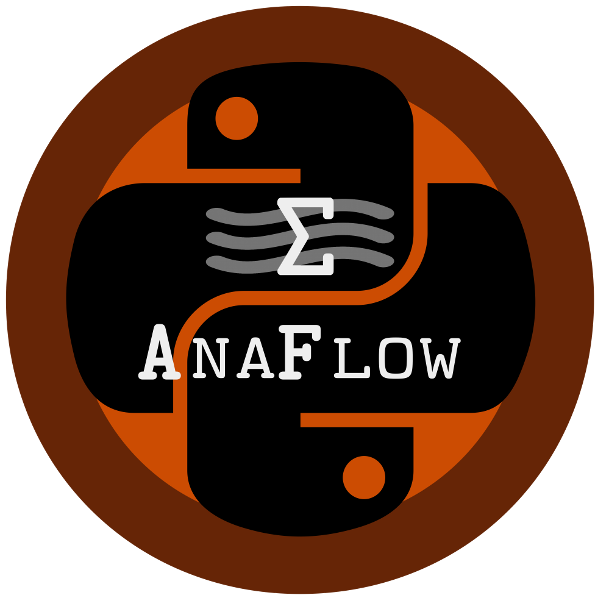

==================
AnaFlow Quickstart
==================

AnaFlow provides several analytical and semi-analytical solutions for the
groundwater-flow equation.

Installation
============

The package can be installed via `pip <https://pypi.org/project/gstools/>`_.
On Windows you can install `WinPython <https://winpython.github.io/>`_ to get
Python and pip running.

.. code-block:: none

    pip install anaflow

Provided Functions
==================

The following functions are provided directly

* :any:`thiem` Thiem solution for steady state pumping
* :any:`theis` Theis solution for transient pumping
* :any:`ext_thiem_2d` extended Thiem solution in 2D from *Zech 2013*
* :any:`ext_theis_2d` extended Theis solution in 2D from *Mueller 2015*
* :any:`ext_thiem_3d` extended Thiem solution in 3D from *Zech 2013*
* :any:`ext_theis_3d` extended Theis solution in 3D from *Mueller 2015*
* :any:`neuman2004` transient solution from *Neuman 2004*
* :any:`neuman2004_steady` steady solution from *Neuman 2004*
* :any:`grf` "General Radial Flow" Model from *Barker 1988*
* :any:`ext_grf` the transient extended GRF model
* :any:`ext_grf_steady` the steady extended GRF model
* :any:`ext_thiem_tpl` extended Thiem solution for truncated power laws
* :any:`ext_theis_tpl` extended Theis solution for truncated power laws
* :any:`ext_thiem_tpl_3d` extended Thiem solution in 3D for truncated power laws
* :any:`ext_theis_tpl_3d` extended Theis solution in 3D for truncated power laws

Laplace Transformation
======================

We provide routines to calculate the laplace-transformation as well as the
inverse laplace-transformation of a given function

* :any:`get_lap` Get the laplace transformation of a function
* :any:`get_lap_inv` Get the inverse laplace transformation of a function

Requirements
============

- `NumPy >= 1.14.5 <https://www.numpy.org>`_
- `SciPy >= 1.1.0 <https://www.scipy.org/>`_
- `pentapy <https://github.com/GeoStat-Framework/pentapy>`_

License
=======

`MIT <https://github.com/GeoStat-Framework/AnaFlow/blob/master/LICENSE>`_
