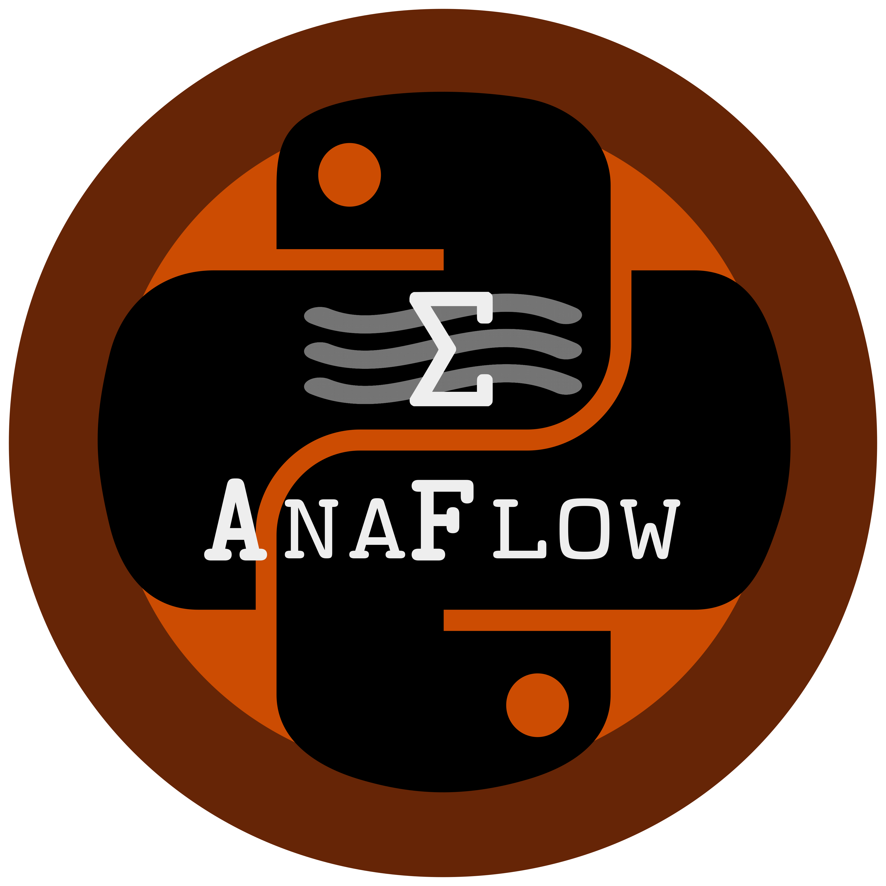

==============================================================================
AnaFlow: A python-package containing analytical solutions for groundwater flow
==============================================================================

Contents
--------
Anaflow provides several analytical and semi-analytical solutions for the
groundwater-flow-equation.

Dependencies
------------
- `Numpy <http://www.numpy.org>`_: 1.10.0 or higher
- `SciPy <http://www.scipy.org>`_: 0.19.0 or higher

Installation
------------
The anaflow package is on PyPi. Just  run the following command:

    ``pip install -U anaflow``

It is highly recomended to install the scipy-scikit `umfpack` to get a solver
for sparse linear systems:

    ``pip install -U scikit-umfpack``

Under Ubuntu you can install the required SuiteSparse library with:

    ``sudo apt-get install libsuitesparse-dev``

For further information have a look at:
    * http://pypi.python.org/pypi/scikit-umfpack
    * http://faculty.cse.tamu.edu/davis/suitesparse.html

Modules
-------
.. toctree::
   :maxdepth: 2

   main
