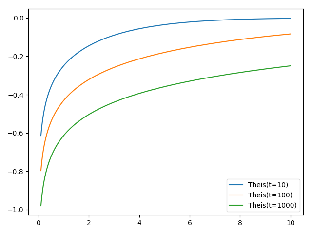

Tutorial 1: The Theis solution
==============================

In the following the well known Theis function is called an plotted for three
different time-steps.

.. code-block:: python

    import numpy as np
    from matplotlib import pyplot as plt
    from anaflow import theis

    time = [10, 100, 1000]
    rad = np.geomspace(0.1, 10)

    head = theis(time=time, rad=rad, transmissivity=1e-4, storage=1e-4, rate=-1e-4)

    for i, step in enumerate(time):
        plt.plot(rad, head[i], label="Theis(t={})".format(step))

    plt.legend()
    plt.show()

