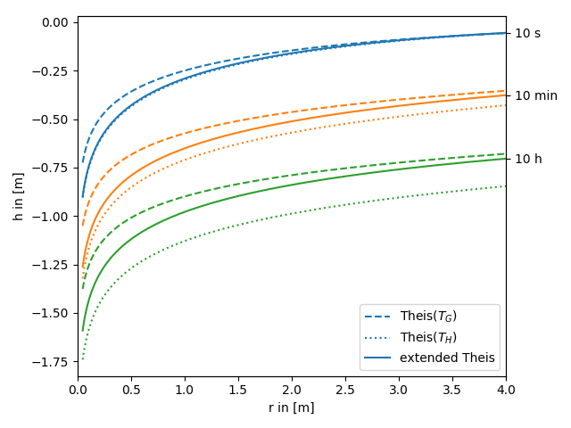

Tutorial 2: The extended Theis solution
=======================================

We provide an extended theis solution, that incorporates the effectes of a
heterogeneous transmissivity field on a pumping test.

In the following this extended solution is compared to the standard theis
solution for well flow. You can nicely see, that the extended solution represents
a transition between the theis solutions for the geometric- and harmonic-mean
transmissivity.

.. code-block:: python

    import numpy as np
    from matplotlib import pyplot as plt
    from anaflow import theis, ext_theis2D

    time = [10, 600, 36000]      # 10s, 10min, 10h
    rad = np.geomspace(0.05, 4)  # radius from the pumping well in [0, 4]
    var = 0.5                    # variance of the log-transmissivity
    corr = 10.0                  # correlation length of the transmissivity
    TG = 1e-4                    # the geometric mean of the transmissivity
    TH = TG*np.exp(-var/2.0)     # the harmonic mean of the transmissivity
    S = 1e-4                     # storativity
    Qw = -1e-4                   # pumping rate

    head_TG = theis(rad=rad, time=time, T=TG, S=S, Qw=Qw)
    head_TH = theis(rad=rad, time=time, T=TH, S=S, Qw=Qw)
    head_ef = ext_theis2D(rad=rad, time=time, TG=TG, sig2=var, corr=corr, S=S, Qw=Qw)

    for i, step in enumerate(time):
        if i == 0:
            label_TG = "Theis($T_G$)"
            label_TH = "Theis($T_H$)"
            label_ef = "extended Theis"
        else:
            label_TG = label_TH = label_ef = None
        plt.plot(rad, head_TG[i], label=label_TG, color="C"+str(i), linestyle="--")
        plt.plot(rad, head_TH[i], label=label_TH, color="C"+str(i), linestyle=":")
        plt.plot(rad, head_ef[i], label=label_ef, color="C"+str(i))

    plt.xlabel("r in [m]")
    plt.ylabel("h in [m]")
    plt.legend()
    plt.show()

