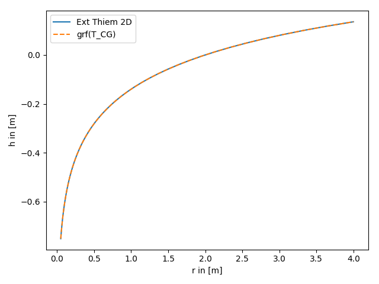
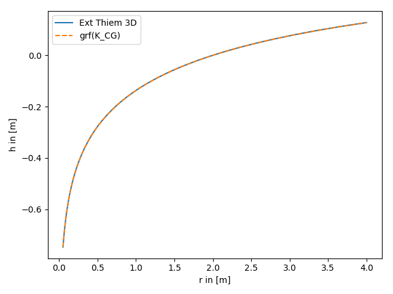
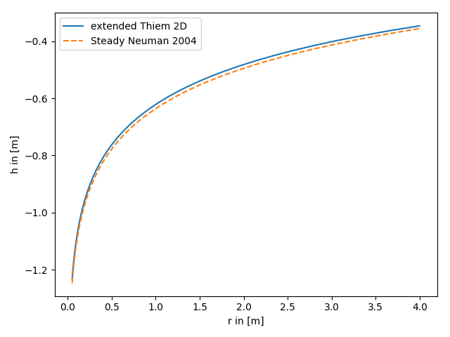
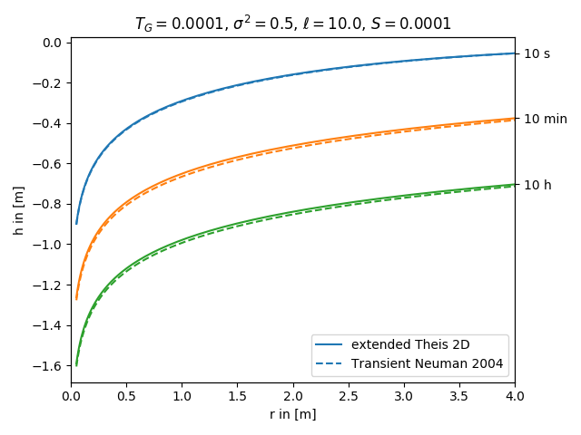

Tutorial 6: Comparison of different solutions
=============================================

In the following we compare a set of different solutions of the groundwater
flow equation.

1. extended Thiem 2D vs. steady solution for coarse graining transmissivity
---------------------------------------------------------------------------

The extended Thiem 2D solutions is the analytical solution of the groundwater
flow equation for the coarse graining transmissivity for pumping tests.
Therefore the results should coincide.

References:

- `Schneider & Attinger 2008 <https://doi.org/10.1029/2007WR005898>`__
- `Zech & Attinger 2016 <https://doi.org/10.5194/hess-20-1655-2016>`__

.. code-block:: python

    import numpy as np
    from matplotlib import pyplot as plt
    from anaflow import ext_thiem_2d, ext_grf_steady
    from anaflow.tools.coarse_graining import T_CG

    rad = np.geomspace(0.05, 4)  # radius from the pumping well in [0, 4]
    r_ref = 2.0                  # reference radius
    var = 0.5                    # variance of the log-transmissivity
    len_scale = 10.0             # correlation length of the log-transmissivity
    TG = 1e-4                    # the geometric mean of the transmissivity
    rate = -1e-4                 # pumping rate

    head1 = ext_thiem_2d(rad, r_ref, TG, var, len_scale, rate)
    head2 = ext_grf_steady(rad, r_ref, T_CG, rate=rate, trans_gmean=TG, var=var, len_scale=len_scale)

    plt.plot(rad, head1, label="Ext Thiem 2D")
    plt.plot(rad, head2, label="grf(T_CG)", linestyle="--")

    plt.xlabel("r in [m]")
    plt.ylabel("h in [m]")
    plt.legend()
    plt.tight_layout()
    plt.show()

2. extended Thiem 3D vs. steady solution for coarse graining conductivity
-------------------------------------------------------------------------

The extended Thiem 3D solutions is the analytical solution of the groundwater
flow equation for the coarse graining conductivity for pumping tests.
Therefore the results should coincide.

Reference: `Zech et. al. 2012 <https://doi.org/10.1029/2012WR011852>`__

.. code-block:: python

    import numpy as np
    from matplotlib import pyplot as plt
    from anaflow import ext_thiem_3d, ext_grf_steady
    from anaflow.tools.coarse_graining import K_CG

    rad = np.geomspace(0.05, 4)  # radius from the pumping well in [0, 4]
    r_ref = 2.0                  # reference radius
    var = 0.5                    # variance of the log-transmissivity
    len_scale = 10.0             # correlation length of the log-transmissivity
    KG = 1e-4                    # the geometric mean of the transmissivity
    anis = 0.7                   # aniso ratio
    rate = -1e-4                 # pumping rate

    head1 = ext_thiem_3d(rad, r_ref, KG, var, len_scale, anis, 1, rate)
    head2 = ext_grf_steady(rad, r_ref, K_CG, rate=rate, cond_gmean=KG, var=var, len_scale=len_scale, anis=anis)

    plt.plot(rad, head1, label="Ext Thiem 3D")
    plt.plot(rad, head2, label="grf(K_CG)", linestyle="--")

    plt.xlabel("r in [m]")
    plt.ylabel("h in [m]")
    plt.legend()
    plt.tight_layout()
    plt.show()

3. extended Thiem 2D vs. steady solution for apparent transmissivity from Neuman
--------------------------------------------------------------------------------

Both, the extended Thiem and the Neuman solution, represent an effective steady
drawdown in a heterogeneous aquifer.
In both cases the heterogeneity is represented by two point statistics,
characterized by mean, variance and length scale of the log transmissivity field.
Therefore these approaches should lead to similar results.

References:

- `Neuman 2004 <https://doi.org/10.1029/2003WR002405>`__
- `Zech & Attinger 2016 <https://doi.org/10.5194/hess-20-1655-2016>`__

.. code-block:: python

    import numpy as np
    from matplotlib import pyplot as plt
    from anaflow import ext_thiem_2d, neuman2004_steady

    rad = np.geomspace(0.05, 4)  # radius from the pumping well in [0, 4]
    r_ref = 30.0                 # reference radius
    var = 0.5                    # variance of the log-transmissivity
    len_scale = 10.0             # correlation length of the log-transmissivity
    TG = 1e-4                    # the geometric mean of the transmissivity
    rate = -1e-4                 # pumping rate

    head1 = ext_thiem_2d(rad, r_ref, TG, var, len_scale, rate)
    head2 = neuman2004_steady(rad, r_ref, TG, var, len_scale, rate)

    plt.plot(rad, head1, label="extended Thiem 2D")
    plt.plot(rad, head2, label="Steady Neuman 2004", linestyle="--")

    plt.xlabel("r in [m]")
    plt.ylabel("h in [m]")
    plt.legend()
    plt.tight_layout()
    plt.show()

4. extended Theis 2D vs. transient solution for apparent transmissivity from Neuman
-----------------------------------------------------------------------------------

Both, the extended Theis and the Neuman solution, represent an effective transient
drawdown in a heterogeneous aquifer.
In both cases the heterogeneity is represented by two point statistics,
characterized by mean, variance and length scale of the log transmissivity field.
Therefore these approaches should lead to similar results.

References:

- `Neuman 2004 <https://doi.org/10.1029/2003WR002405>`__
- `Zech et. al. 2016 <http://dx.doi.org/10.1002/2015WR018509>`__

.. code-block:: python

    import numpy as np
    from matplotlib import pyplot as plt
    from anaflow import ext_theis_2d, neuman2004

    time_labels = ["10 s", "10 min", "10 h"]
    time = [10, 600, 36000]      # 10s, 10min, 10h
    rad = np.geomspace(0.05, 4)  # radius from the pumping well in [0, 4]
    TG = 1e-4                    # the geometric mean of the transmissivity
    var = 0.5                    # correlation length of the log-transmissivity
    len_scale = 10.0             # variance of the log-transmissivity
    S = 1e-4                     # storativity
    rate = -1e-4                 # pumping rate

    head1 = ext_theis_2d(time, rad, S, TG, var, len_scale, rate)
    head2 = neuman2004(time, rad, S, TG, var, len_scale, rate)
    time_ticks=[]
    for i, step in enumerate(time):
        label1 = "extended Theis 2D" if i == 0 else None
        label2 = "Transient Neuman 2004" if i == 0 else None
        plt.plot(rad, head1[i], label=label1, color="C"+str(i))
        plt.plot(rad, head2[i], label=label2, color="C"+str(i), linestyle="--")
        time_ticks.append(head1[i][-1])

    plt.title("$T_G={}$, $\sigma^2={}$, $\ell={}$, $S={}$".format(TG, var, len_scale, S))
    plt.xlabel("r in [m]")
    plt.ylabel("h in [m]")
    plt.legend()
    ylim = plt.gca().get_ylim()
    plt.gca().set_xlim([0, rad[-1]])
    ax2 = plt.gca().twinx()
    ax2.set_yticks(time_ticks)
    ax2.set_yticklabels(time_labels)
    ax2.set_ylim(ylim)
    plt.tight_layout()
    plt.show()

