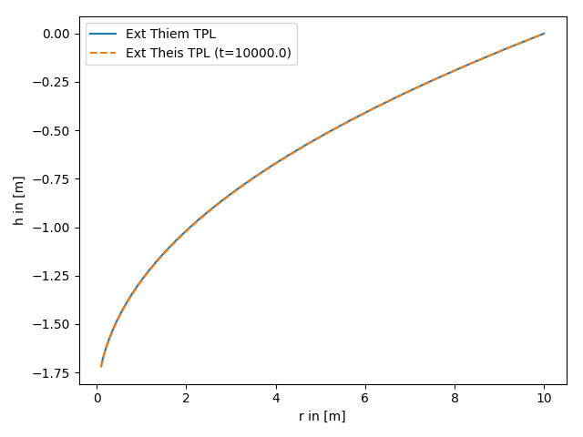
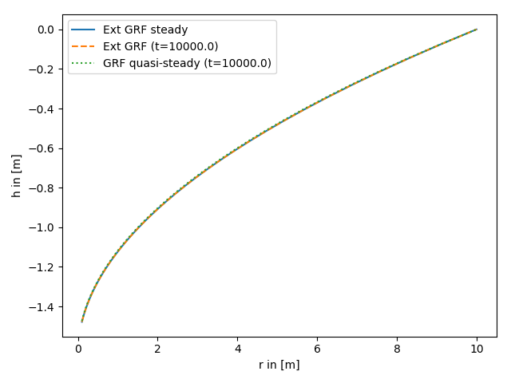
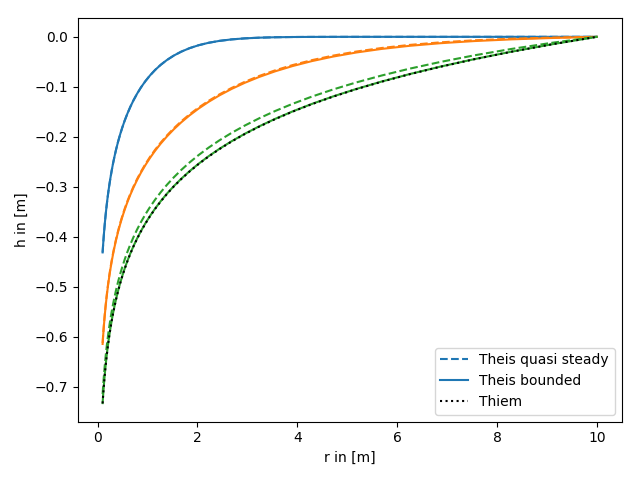

Tutorial 7: Convergence of different solutions
==============================================

In the following we analyze the convergence of some solutions of the groundwater
flow equation.

1. Convergence of the extended Theis solutions for truncated power laws
-----------------------------------------------------------------------

Here we set an outer boundary to the transient solution, so this condition
coincides with the references head of the steady solution.

Reference: (not yet published)

.. code-block:: python

    import numpy as np
    from matplotlib import pyplot as plt
    from anaflow import ext_theis_tpl, ext_thiem_tpl

    time = 1e4                   # time point for steady state
    rad = np.geomspace(0.1, 10)  # radius from the pumping well in [0, 4]
    r_ref = 10.0                 # reference radius
    KG = 1e-4                    # the geometric mean of the transmissivity
    len_scale = 5.0              # correlation length of the log-transmissivity
    hurst = 0.5                  # hurst coefficient
    var = 0.5                    # variance of the log-transmissivity
    rate = -1e-4                 # pumping rate
    dim = 1.5                    # using a fractional dimension

    head1 = ext_thiem_tpl(rad, r_ref, KG, len_scale, hurst, var, dim=dim, rate=rate)
    head2 = ext_theis_tpl(time, rad, 1e-4, KG, len_scale, hurst, var, dim=dim, rate=rate, r_bound=r_ref)

    plt.plot(rad, head1, label="Ext Thiem TPL")
    plt.plot(rad, head2, label="Ext Theis TPL (t={})".format(time), linestyle="--")

    plt.xlabel("r in [m]")
    plt.ylabel("h in [m]")
    plt.legend()
    plt.tight_layout()
    plt.show()

2. Convergence of the general radial flow model (GRF)
-----------------------------------------------------

The GRF model introduces an arbitrary flow dimension and was presented to
analyze groundwater flow in rock formations.
In the following we compare the bounded transient solution for late times,
the unbounded quasi steady solution and the steady state.

Reference: `Barker 1988 <https://doi.org/10.1029/WR024i010p01796>`__

.. code-block:: python

    import numpy as np
    from matplotlib import pyplot as plt
    from anaflow import ext_grf, ext_grf_steady, grf

    time = 1e4                   # time point for steady state
    rad = np.geomspace(0.1, 10)  # radius from the pumping well in [0, 4]
    r_ref = 10.0                 # reference radius
    K = 1e-4                     # the geometric mean of the transmissivity
    rate = -1e-4                 # pumping rate
    dim = 1.5                    # using a fractional dimension

    head1 = ext_grf_steady(rad, r_ref, K, dim=dim, rate=rate)
    head2 = ext_grf(time, rad, [1e-4], [K], [0, r_ref], dim=dim, rate=rate)
    head3 = grf(time, rad, 1e-4, K, dim=dim, rate=rate)
    head3 -= head3[-1]  # quasi-steady

    plt.plot(rad, head1, label="Ext GRF steady")
    plt.plot(rad, head2, label="Ext GRF (t={})".format(time), linestyle="--")
    plt.plot(rad, head3, label="GRF quasi-steady (t={})".format(time), linestyle=":")

    plt.xlabel("r in [m]")
    plt.ylabel("h in [m]")
    plt.legend()
    plt.tight_layout()
    plt.show()

3. Quasi steady Theis vs. Thiem
-------------------------------

Since a lot of pumping test analysis is done by interpreting the so called
quasi steady state, we will compare the quasi steady state of theis, a late
time head of the bounded theis and the thiem solution.

References:

- `Theis 1935 <https://doi.org/10.1029/TR016i002p00519>`__
- `Thiem 1906 <https://scholar.google.com/scholar_lookup?title=Hydrologische%20methoden&publication_year=1906&author=G.%20Thiem>`__

.. code-block:: python

    import numpy as np
    from matplotlib import pyplot as plt
    from anaflow import theis, thiem

    time = [10, 100, 1000]
    rad = np.geomspace(0.1, 10)
    r_ref = 10.0

    head_ref = theis(time, np.full_like(rad, r_ref), storage=1e-3, transmissivity=1e-4, rate=-1e-4)
    head1 = theis(time, rad, storage=1e-3, transmissivity=1e-4, rate=-1e-4) - head_ref
    head2 = theis(time, rad, storage=1e-3, transmissivity=1e-4, rate=-1e-4, r_bound=r_ref)
    head3 = thiem(rad, r_ref, transmissivity=1e-4, rate=-1e-4)

    for i, step in enumerate(time):
        label_1 = "Theis quasi steady" if i == 0 else None
        label_2 = "Theis bounded" if i == 0 else None
        plt.plot(rad, head1[i], label=label_1, color="C"+str(i), linestyle="--")
        plt.plot(rad, head2[i], label=label_2, color="C"+str(i))

    plt.plot(rad, head3, label="Thiem", color="k", linestyle=":")

    plt.xlabel("r in [m]")
    plt.ylabel("h in [m]")
    plt.legend()
    plt.tight_layout()
    plt.show()

