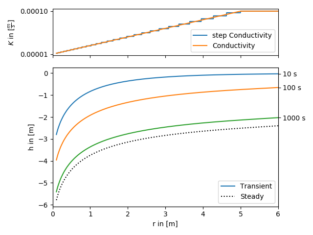
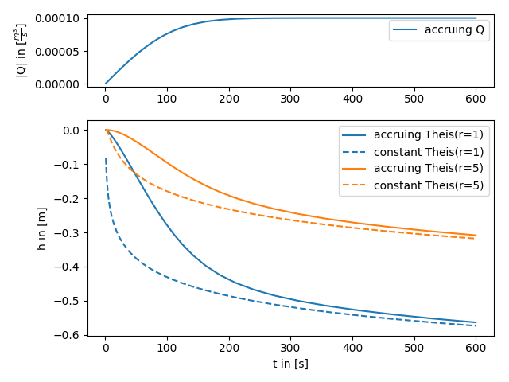
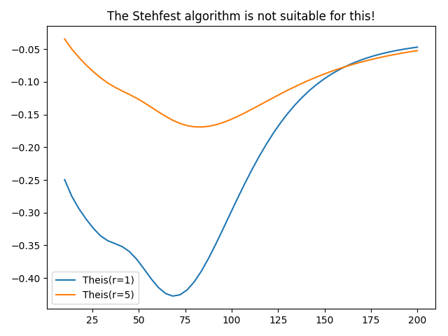

Tutorial 8: Advanced stuff
==========================

Beside the implementations of solutions form literatur, AnaFlow provides
some advanced features to pimp the solutions for the groundwater flow equation.

1. Self defined radial conductivity or transmissivity
-----------------------------------------------------

All heterogeneous solutions of AnaFlow are derived by calculating an equivalent
step function of a radial symmetric transmissivity resp. conductivity function.

The following code shows how to apply this workflow to a self defined
transmissivity function. The function in use represents a linear transition
from a local to a far field value of transmissivity within a given range.

The step function is calculated as the harmonic mean within given bounds,
since the groundwater flow under a pumping condition is perpendicular to the
different annular regions of transmissivity.

Reference: (not yet published)

.. code-block:: python

    import numpy as np
    from matplotlib import pyplot as plt
    import matplotlib.gridspec as gridspec
    from anaflow import ext_grf, ext_grf_steady
    from anaflow.tools import specialrange_cut, annular_hmean, step_f

    def cond(rad, K_far, K_well, len_scale):
        """Conductivity with linear increase from K_well to K_far."""
        return np.minimum(np.abs(rad) / len_scale, 1.0) * (K_far - K_well) + K_well

    time_labels = ["10 s", "100 s", "1000 s"]
    time = [10, 100, 1000]
    rad = np.geomspace(0.1, 6)
    S = 1e-4
    K_well = 1e-5
    K_far = 1e-4
    len_scale = 5.0
    rate = -1e-4
    dim = 1.5

    cut_off = len_scale
    parts = 30
    r_well = 0.0
    r_bound = 50.0

    # calculate a disk-distribution of "trans" by calculating harmonic means
    R_part = specialrange_cut(r_well, r_bound, parts, cut_off)
    K_part = annular_hmean(cond, R_part, ann_dim=dim, K_far=K_far, K_well=K_well, len_scale=len_scale)
    S_part = np.full_like(K_part, S)
    # calculate transient and steady heads
    head1 = ext_grf(time, rad, S_part, K_part, R_part, dim=dim, rate=rate)
    head2 = ext_grf_steady(rad, r_bound, cond, dim=dim, rate=-1e-4, K_far=K_far, K_well=K_well, len_scale=len_scale)

    # plotting
    gs = gridspec.GridSpec(2, 1, height_ratios=[1, 3])
    ax1 = plt.subplot(gs[0])
    ax2 = plt.subplot(gs[1], sharex=ax1)
    time_ticks=[]
    for i, step in enumerate(time):
        label = "Transient" if i == 0 else None
        ax2.plot(rad, head1[i], label=label, color="C"+str(i))
        time_ticks.append(head1[i][-1])

    ax2.plot(rad, head2, label="Steady", color="k", linestyle=":")

    rad_lin = np.linspace(rad[0], rad[-1], 1000)
    ax1.plot(rad_lin, step_f(rad_lin, R_part, K_part), label="step Conductivity")
    ax1.plot(rad_lin, cond(rad_lin, K_far, K_well, len_scale), label="Conductivity")
    ax1.set_yticks([K_well, K_far])
    ax1.set_ylabel(r"$K$ in $[\frac{m}{s}]$")
    plt.setp(ax1.get_xticklabels(), visible=False)
    ax1.legend()
    ax2.set_xlabel("r in [m]")
    ax2.set_ylabel("h in [m]")
    ax2.legend()
    ax2.set_xlim([0, rad[-1]])
    ax3 = ax2.twinx()
    ax3.set_yticks(time_ticks)
    ax3.set_yticklabels(time_labels)
    ax3.set_ylim(ax2.get_ylim())

    plt.tight_layout()
    plt.show()

2. Accruing pumping rate
------------------------

AnaFlow provides different representations for the pumping condition.
One is an accruing pumping rate represented by the error function.
This could be interpreted as that the water pump needs a certain time to
reach its constant rate state.

.. code-block:: python

    import numpy as np
    from scipy.special import erf
    from matplotlib import pyplot as plt
    import matplotlib.gridspec as gridspec
    from anaflow import theis

    time = np.geomspace(1, 600)
    rad = [1, 5]

    # Q(t) = Q * erf(t / a)
    a = 120
    lap_kwargs = {"cond": 4, "cond_kw": {"a": a}}
    head1 = theis(
        time=time,
        rad=rad,
        storage=1e-4,
        transmissivity=1e-4,
        rate=-1e-4,
        lap_kwargs=lap_kwargs,
    )
    head2 = theis(
        time=time,
        rad=rad,
        storage=1e-4,
        transmissivity=1e-4,
        rate=-1e-4,
    )
    gs = gridspec.GridSpec(2, 1, height_ratios=[1, 3])
    ax1 = plt.subplot(gs[0])
    ax2 = plt.subplot(gs[1], sharex=ax1)

    for i, step in enumerate(rad):
        ax2.plot(
            time,
            head1[:, i],
            color="C" + str(i),
            label="accruing Theis(r={})".format(step),
        )
        ax2.plot(
            time,
            head2[:, i],
            color="C" + str(i),
            label="constant Theis(r={})".format(step),
            linestyle="--"
        )
    ax1.plot(time, 1e-4 * erf(time / a), label="accruing Q")
    ax2.set_xlabel("t in [s]")
    ax2.set_ylabel("h in [m]")
    ax1.set_ylabel(r"|Q| in [$\frac{m^3}{s}$]")
    ax1.legend()
    ax2.legend()
    plt.tight_layout()
    plt.show()

3. Interval pumping
-------------------

Another case often discussed in literatur is interval pumping, where
the pumping is just done in a certain time frame.

Unfortunatly the Stehfest algorithm is not suitable for this kind of solution,
which is demonstrated in the following script.

.. code-block:: python

    import numpy as np
    from matplotlib import pyplot as plt
    from anaflow import theis

    time = np.linspace(10, 200)
    rad = [1, 5]

    # Q(t) = Q * characteristic([0, T])
    lap_kwargs = {"cond": 3, "cond_kw": {"a": 100}}
    head = theis(
        time=time,
        rad=rad,
        storage=1e-4,
        transmissivity=1e-4,
        rate=-1e-4,
        lap_kwargs=lap_kwargs,
    )

    for i, step in enumerate(rad):
        plt.plot(time, head[:, i], label="Theis(r={})".format(step))

    plt.title("The Stehfest algorithm is not suitable for this!")
    plt.legend()
    plt.tight_layout()
    plt.show()

